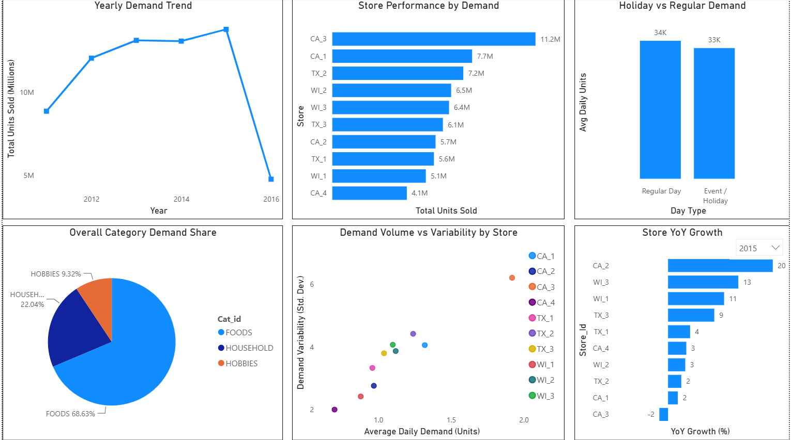
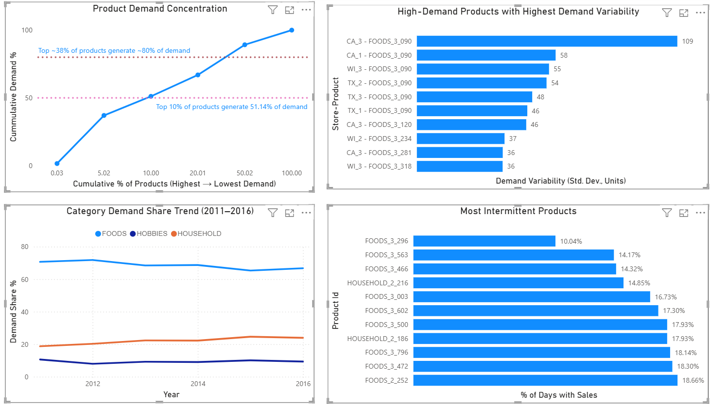

# Walmart Sales & Inventory Analysis

A data analytics project using Walmart historical sales data to identify demand patterns, product concentration, store-level differences, demand variability, and intermittent demand, and translate these findings into practical business recommendations.

---

## 📋 Table of Contents

- [Project Overview](#project-overview)
- [Business Problem](#business-problem)
- [Project Objectives](#project-objectives)
- [Project Workflow](#project-workflow)
- [Data Transformation](#data-transformation)
- [Analysis Performed](#analysis-performed)
- [Power BI Dashboard](#power-bi-dashboard)
- [Key Business Insights](#key-business-insights)
- [Business Recommendations](#business-recommendations)
- [Tools & Technologies](#tools--technologies)
- [Repository Structure](#repository-structure)
- [Dataset Source](#dataset-source)
- [Limitations](#limitations)
- [Documentation](#documentation)

---

## 🎯 Project Overview

This project analyzes Walmart historical sales data to understand how demand varies across products, categories, stores, and time.

The analysis focuses on:

- Overall demand trends
- Store performance and year-over-year growth
- Category contribution and category trends
- Product demand concentration
- High-demand and high-variability products
- Intermittent demand
- Holiday and event demand patterns

The project combines **Python, SQL Server, and Power BI** to transform a large raw dataset into structured analysis and actionable business insights.

---

## 🏢 Business Problem

Large-scale retail sales data contains valuable information about customer demand, but the raw structure can make analysis difficult.

This project was developed to identify:

- Where demand is concentrated
- Which categories contribute most to overall demand
- Which store-product combinations have high and variable demand
- Which products have intermittent sales activity
- How demand differs across stores and over time

The final objective was to convert these findings into practical recommendations for demand and inventory planning.

---

## 🎯 Project Objectives

1. Understand how overall demand changes over time.
2. Evaluate differences in store performance and growth.
3. Understand category contribution and category demand trends.
4. Examine holiday versus regular-day demand.
5. Measure product demand concentration.
6. Identify high-demand store-product combinations with substantial demand variability.
7. Identify products with intermittent demand.
8. Develop an interactive Power BI dashboard.
9. Translate analytical findings into actionable business insights.

---

## 🔄 Project Workflow

**Raw Walmart Dataset**  
↓  
**Python Data Transformation**  
↓  
**SQL Server**  
↓  
**Analytical Queries**  
↓  
**Power BI Dashboard**  
↓  
**Business Insights & Recommendations**

---


## 🐍 Data Transformation

The original sales dataset stored daily observations across **1,913 separate date columns**.

Python was used to restructure the dataset so that the dates were represented as rows rather than separate columns.

The resulting structure allowed each observation to be represented using fields such as:

- `item_id`
- `dept_id`
- `cat_id`
- `store_id`
- `state_id`
- `sale_date`
- `units_sold`

This transformation made the data more suitable for time-based analysis, aggregation, and SQL processing.

The data loading process was carried out in stages. Initially, SQL Server was configured to store database files on the C: drive, and approximately 45 million rows had been loaded before storage limitations were encountered. SQL Server's data storage was then moved to the D: drive, allowing the loading process to continue from the data that had already been processed rather than restarting from the beginning.

The Python transformation and loading scripts are included in:

**data_transformation_py/**

- `load_sales.py`
- `old_load_sales.py`

---

## 📊 Analysis Performed

The project includes the following major analyses:

### 1. Yearly Demand Trend

Examines how total unit demand changes across the analysis period.

### 2. Store Performance by Demand

Compares demand across stores and evaluates year-over-year changes in store demand.

### 3. Category Demand Share

Measures the contribution of FOODS, HOUSEHOLD, and HOBBIES to total unit demand.

### 4. Demand Volume vs Variability by Store

Examines the relationship between average daily demand and demand variability across stores.

### 5. Holiday vs Regular Demand

Compares demand on regular days with demand on recorded holiday/event days.

### 6. Store Year-over-Year Growth

Identifies differences in annual store performance and growth patterns.

### 7. Product Demand Concentration

Analyzes how total demand is distributed across the product portfolio.

### 8. High-Demand Products with Highest Demand Variability

Identifies store-product combinations with both above-average demand and above-average demand variability.

### 9. Demand Intermittency

Identifies products that record sales on a relatively small percentage of days.

### 10. Category Demand Trend Over Time

Examines how the demand contribution of different categories changes over the analysis period.

---

## 📈 Power BI Dashboard

The analysis was presented through a two-page interactive Power BI dashboard.

### Page 1 — Business Overview



### Page 2 — Strategic & Operational Insights



The dashboard provides both a high-level view of demand and more detailed product and operational insights.

---

## 💡 Key Business Insights

### 1. Demand Is Highly Concentrated

The **top 10% of products account for 51.14% of total unit demand**, while approximately 38% of products account for around 80% of demand.

This indicates that a relatively small group of products has a disproportionate influence on overall demand.

### 2. FOODS Is the Dominant Category

The FOODS category contributes **68.63% of total unit demand**, making it the largest demand category in the dataset.

### 3. High Demand Can Come With High Variability

The analysis identified **2,116 store-product combinations** with both above-average demand and above-average demand variability.

These combinations represent products where demand is substantial but less stable.

### 4. Some Products Have Highly Intermittent Demand

For example, **FOODS_3_296 recorded sales on only 10.04% of the 1,913 days** covered by the dataset.

This shows that sales frequency varies considerably across products.

### 5. Store Demand Is Not Uniform

Store-level analysis showed differences in demand and year-over-year performance, indicating that demand patterns can vary between stores.

---

## 🎯 Business Recommendations

Based on the analysis, the project recommends:

- Prioritize **high-contribution products** in forecasting and replenishment reviews.
- Closely monitor **high-demand/high-variability store-product combinations**.
- Treat **highly intermittent products** as a separate planning group.
- Give greater planning attention to the **FOODS category**, particularly its high-demand products.
- Consider **store-level demand patterns** when developing planning assumptions.

These recommendations are intended as demand-planning signals. The dataset does not contain actual inventory or stockout information, so the analysis does not claim to identify confirmed stockouts or inventory shortages.

---

## 🛠️ Tools & Technologies

| Tool | Purpose |
|---|---|
| **Python** | Data transformation and restructuring |
| **SQL Server** | Data processing, aggregation, and analysis |
| **Power BI** | Dashboard development and visualization |
| **DAX** | Power BI calculations |
| **GitHub** | Project versioning and presentation |

---

## 📁 Repository Structure

```text
Walmart-Sales-Inventory-Analysis/
│
├── README.md
├── Walmart_Sales_Inventory_Project_Documentation.pdf
├── Appendix_A_SQL_Queries.pdf
├── Business_Insight.pdf
├── Walmart_Sales_Analysis.pbix
│
├── data_transformation_py/
│   ├── load_sales.py
│   └── old_load_sales.py
│
├── SQL/
│   ├── 01_Yearly_Demand_Trend.sql
│   ├── 02_Store_Performance.sql
│   ├── 03_Category_Demand_Share.sql
│   ├── 04_Demand_Volume_vs_Variability.sql
│   ├── 05_Holiday_vs_Regular_Demand.sql
│   ├── 06_Store_YoY_Growth.sql
│   ├── 07_Product_Demand_Concentration.sql
│   ├── 08_High_Demand_High_Variability.sql
│   ├── 09_Demand_Intermittency.sql
│   └── 10_Category_Demand_Trend.sql
│
└── images/
    ├── dashboard_business_overview.png
    ├── dashboard_strategic_operational_insights.png
    └── power_bi_data_model.png
```

---

## 📚 Dataset Source

The project uses the M5 Forecasting Accuracy dataset containing Walmart sales, calendar, and selling-price data.

The original raw dataset is not included in this repository due to its large size.

**Source:** Zenodo — M5 Forecasting Accuracy Dataset

**DOI:** 10.5281/zenodo.12636070

---

## ⚠️ Limitations

The dataset covers January 29, 2011 to April 24, 2016.

2016 is a partial year and should not be interpreted as a complete annual period.

The analysis focuses on units sold, not revenue, profit, or margins.

Actual inventory and stockout data were not available.

The dataset provides limited information about the underlying causes of changes in demand.

Holiday/event analysis showed only a limited overall difference between regular and holiday/event days.

---

## 📄 Documentation

Detailed project documentation is provided in the following files:

### Technical Documentation

Covers the dataset, data preparation, SQL analysis, Power BI development, challenges, limitations, and methodology.

### Appendix A — SQL Queries

Contains the finalized SQL queries used for the analyses presented in the dashboard.

### Business Insights & Recommendations

Presents the major findings from a business perspective and translates them into practical recommendations.

---

## 👤 Project Goal

The overall goal of this project was to transform a large-scale Walmart sales dataset into clear, data-driven business insights using Python, SQL Server, and Power BI.

The project demonstrates the complete process from data transformation and SQL analysis to visualization and business decision-making.
